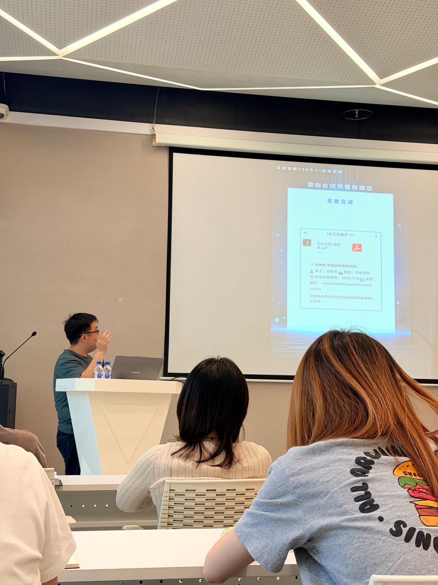

今天去听了个讲座，讲企业级agent助力HR工作这么个主题。做好了没啥干货的准备，但没想到这么水。

有个听众提了个他们公司遇到的难点，就是考勤规则变化了导致原有系统不满足了，但出于找其他公司来迭代系统会有较大成本的痛点，问老师能不能利用agent来解决，老师竟然说用提示词来写考勤规则，说之后想怎么变就用自然语言来改规则就行，我也是震惊了，他居然是这么来适配的🙃

然后到了演示环节，我还期待着老师的实际案例，没想到老师直接打开了电脑中早就安装好的Hermes🥲，然后我等他要做什么操作，老师让Hermes写了个skill，内容大概就是找出文件中合同快到期的员工并用企微消息通知员工，写完skill后老师运行了一下，然后说看到了吗我的企业微信已经收到了消息，就这样，这就是“agent落地企业”的讲座？？？

